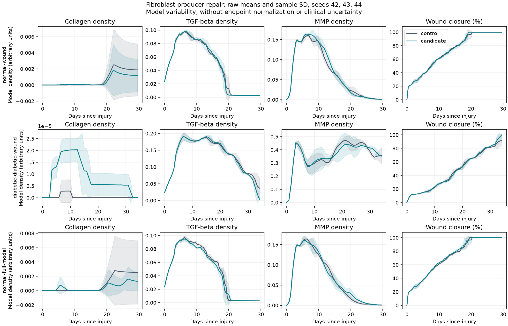

# Fibroblast collagen producer experiment, 2026-10-07

Activated fibroblasts can now synthesize collagen before acquiring the
contractile myofibroblast state. The previous state gate excluded this activity
in both constant-rate and basal-plus-saturating synthesis modes. The repair
changes producer identity without changing numerical parameters, reference
curves or biological screen thresholds.

## Biological evidence and model interpretation

[McAndrews et al. 2022](https://pubmed.ncbi.nlm.nih.gov/35212000/), EMBO Journal
41:e109470, DOI `10.15252/embj.2021109470`, reports Col1a1 expression in
alpha-SMA-negative mouse wound fibroblasts (Fig. 4N). Myofibroblast-specific
Col1a1 deletion reduced collagen deposition (Fig. 4E-H) while preserving wound
closure (Fig. 4I). Depleting the entire myofibroblast population is a separate
intervention with different consequences. These results support allowing
non-myofibroblast producers; they do not establish equal synthesis rates across
states, a human dose-response curve or the coefficients used here.

The activated model state is a coarse-grained synthetic population, rather
than a measured molecular subtype. Both synthetic states use the existing
coefficients. Myofibroblast TGF-beta feedback and state transitions retain
their previous behavior. Oxygen dependence and the existing lactate, nitric
oxide and diabetic modifiers still apply to collagen synthesis.

The source audit also corrected the Vilar et al. citation to
[its computational receptor-network paper](https://doi.org/10.1371/journal.pcbi.0020003).
That paper motivates trafficking mechanisms without measuring the model's
uptake coefficient or its activated/myofibroblast multipliers of 2/5. The
owning code and module documentation now identify those assumptions. Basal
plus saturating synthesis is documented as phenomenological, without claiming
explicit receptor occupancy or an epigenetically locked state. The documented
matrix stiffness output is a dimensionless 0-1 proxy, consistent with its
clamped collagen/elastin formula; no conversion to kPa is implemented.

## Paired simulation results

Control: `0db35c9a44860bd0735e7e599340e203f34c1f9e`, using the nine verified
control runs from the [dermal reaction experiment](../dermal-reactions-20261007/README.md).
Candidate: the producer-gate repair in [source.patch](source.patch).
Comments were refined after the production build; executable statements were
unchanged after that build. [receipt.json](receipt.json) records the measured
binary and dependency hashes for both arms.

Normal wound, diabetic wound and normal full-model cohorts each use seeds
42, 43 and 44. All 18 trajectories are complete and finite, and each paired
configuration is identical apart from output paths. The nine candidate runs
completed successfully as simulations. All nine controls and all nine
candidates fail at least one biological screen. The retained failures are
part of the evidence.

| Cohort | Closure RMSE, control → candidate (%) | TGF-beta RMSE, control → candidate (%) | MMP RMSE, control → candidate (%) |
|--------|--------------------------------------|---------------------------------------|----------------------------------|
| Normal wound | 7.37 → 7.62 | 28.83 → 29.50 | 23.79 → 25.77 |
| Diabetic wound | 18.73 → 19.12 | 41.24 → 40.88 | 14.22 → 14.66 |
| Normal full-model | 7.55 → 7.19 | 30.17 → 28.47 | 21.59 → 22.69 |

These are means over three model seeds, without a claim of statistical or
clinical improvement. Producer identity is repaired, but overall trajectory
agreement remains mixed. Raw collagen becomes positive in all nine candidate
runs; the controls were zero throughout in normal seed 42 and diabetic seeds
43/44. Production does not increase monotonically across matched seeds:
normal seed 42's peak changes from zero to 0.00553719, while normal seed 43's
peak changes from 0.00748903 to 0.0000930059. Several final densities remain
near zero. Existing matrix-linked TGF-beta feedback and remodeling remain
coupled to the changed producer gate; this experiment does not isolate their
individual contributions.

Collagen's very large normalized RMSE values arise when nonzero earlier
measurements are divided by a tiny final density. They are not physical
collagen concentrations. [raw-collagen.csv](raw-collagen.csv) preserves peak
and final densities for every run. [comparison.csv](comparison.csv) and the
three cohort JSON reports retain every tested observable and paired-delta
sample SD; diabetic collagen lacks a tested reference in this comparison.



Bands show mean ± sample SD for three seeds, without endpoint normalization.
They describe model variability, not clinical uncertainty or possible-value
bounds. Density fields have arbitrary model units.

## Verification and reproduction

The two new scheduled regression tests fail under the old gate and pass with
the repair. They exercise both synthesis modes, the quiescent exclusion,
oxygen dependence and TGF-beta responsiveness. All 173 C++ tests pass.
Python workflow tests: 66 pass, three runtime-gated tests skip. All 37 reference
CSVs pass quality checks. Source checks pass with two existing unresolved
locator warnings in the psoriasis and scar source lists.

[replicate_evidence.zip](replicate_evidence.zip) contains 135 byte-verified
files: all 18 configurations, metrics, run receipts, simulation logs and
validation reports; runtime identities; the source patch; and baseline and
candidate test logs. Its inventory and SHA-256 are in `receipt.json`.

With BioDynaMo v1.05.169 and the documented runtime environment, reproduce the
candidate matrix using the maintained runner:

```sh
OMP_NUM_THREADS=1 OMP_DYNAMIC=FALSE python scripts/run_replicates.py \
  --matrix --n 3 --build-dir build --out-dir batch/results/fibro-producers-reproduction
```

The shared synthesis rates, uptake multipliers, collagen-proportional decorin
proxy and stiffness coefficients remain unmeasured assumptions. This pass
supports a wound-fibroblast mechanism repair and corrects associated evidence
claims; it does not validate every module or human wound healing.
