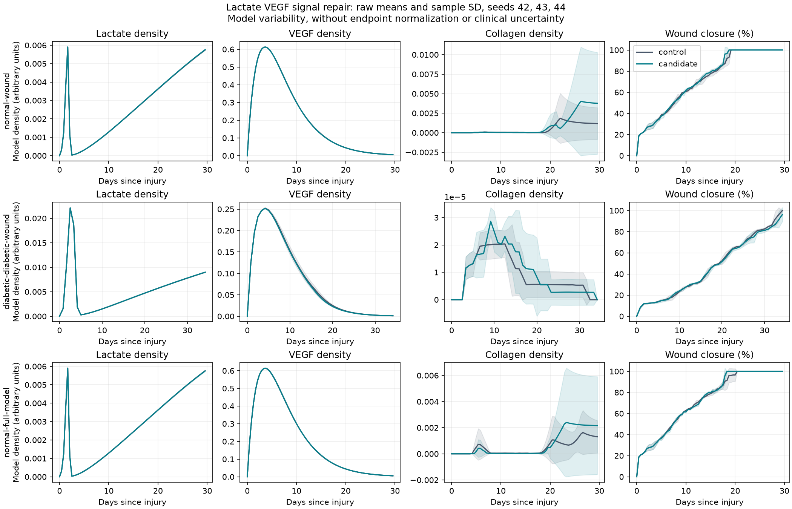

# Lactate VEGF signal experiment, 2026-10-07

Lactate can now stimulate VEGF in oxygenated wound tissue in both the dermal
and epidermal source paths. Previously, this signal was restricted to hypoxic
epidermal wound voxels. The repair changes that dependency without changing
numerical parameters, reference curves or biological screen thresholds.

## Evidence and model interpretation

[Constant et al. 2000](https://pubmed.ncbi.nlm.nih.gov/11115148/) reports
lactate-induced VEGF expression in cultured macrophages.
[Hunt et al. 2007](https://pubmed.ncbi.nlm.nih.gov/17567242/) reports aerobic
endothelial VEGF responses and increased angiogenesis in lactate-polymer
implants. Arterial hypoxia abrogated implant angiogenesis. This supports
separating lactate signaling from the hypoxic VEGF trigger while retaining
oxygen requirements for tissue growth.

The shared source is a tissue-level proxy, without explicit responding cell
types, HIF kinetics or transporter dynamics. The linear coefficient remains
an assumption. Endogenous lactate production still requires hypoxia, so this
repair allows retained or diffused lactate to signal after oxygen recovers.
Aerobic lactate production remains absent. Physical concentration mapping is
needed before using a measured dose-response curve, including the decline at
high exposure. No arbitrary distribution or new dose-response fit was added.
The existing diabetic scaling, time taper and angiogenesis enablement apply
to the signal. Direct hypoxic VEGF production retains its previous behavior.

The [lactate module](../../modules/lactate/README.md) records corrected
citation metadata and the limits of collagen-deposition evidence. The
[MMP module](../../modules/mmp/README.md) now distinguishes isoform-specific
biopsy measurements from assumed pooled production and inhibition rates,
and describes the existing pro-MMP/TIMP implementation accurately. These
documentation repairs do not change remodeling kinetics.

## Paired results

Control: `afe1c62a4dda5f3cc9e4df4bc8bfc945f68be38e`, reusing the nine verified
candidate runs from the [fibroblast producer experiment](../fibroblast-producers-20261007/README.md).
Candidate: the lactate signal repair in [source.patch](source.patch).
This exact-base patch uses zero context and requires `git apply --unidiff-zero`.
[receipt.json](receipt.json) records the measured binary and dependency
hashes for both arms and the exact source-patch hash.

Normal wound, diabetic wound and normal full-model cohorts each use seeds
42, 43 and 44. All 18 trajectories are complete and finite. Paired configurations
match apart from output paths. All nine new simulations completed successfully.
Every control and candidate fails at least one biological screen.

| Cohort | Closure RMSE, control → candidate (%) | TGF-beta RMSE, control → candidate (%) | MMP RMSE, control → candidate (%) |
|--------|--------------------------------------|---------------------------------------|----------------------------------|
| Normal wound | 7.62 → 7.38 | 29.50 → 28.16 | 25.77 → 22.91 |
| Diabetic wound | 19.12 → 19.28 | 40.88 → 44.08 | 14.66 → 13.81 |
| Normal full-model | 7.19 → 7.29 | 28.47 → 27.76 | 22.69 → 22.75 |

These are means over three model seeds, without evidence of clinical or
statistical improvement. Effects on trajectory agreement remain mixed.
Normal seed 42's final collagen density rises from 0.00353741 to 0.0113144,
while full-model seed 44 falls from 0.00144081 to approximately zero. Seven
candidate runs finish with collagen densities below 2e-11. Thus, repairing
the signal does not establish adequate matrix deposition or persistence.

Collagen's very large normalized RMSE values result from dividing earlier
nonzero measurements by tiny final densities. They are not physical collagen
concentrations. [raw-collagen.csv](raw-collagen.csv) retains peaks and final
densities. [comparison.csv](comparison.csv) and the three cohort JSON reports
retain every tested observable and the sample SD of paired error changes.
Diabetic collagen lacks a tested reference in this comparison.



Bands show mean ± sample SD across three seeds without endpoint normalization.
They describe model variability, not clinical uncertainty or possible-value
bounds. Density fields use arbitrary model units.

## Verification and reproduction

The regression fails under the old signal in both oxygenated compartments
and passes with the repair. It uses the production dispatcher and checks zero
lactate, disabled modules, pre-injury tissue, zero boost and sites outside the
wound. All 174 C++ tests pass. Python workflow tests: 66 pass, three
runtime-gated tests skip. The two literature unit suites each pass 22 tests.
All 37 reference CSVs pass quality checks. Source checks pass with two existing
unresolved locator warnings in the psoriasis and scar source lists.

[replicate_evidence.zip](replicate_evidence.zip) contains 136 byte-verified
files, including all 18 configurations, metrics, run receipts, simulation
logs and validation reports, both runtime identities, the source patch and
test logs. Its inventory and SHA-256 are recorded in `receipt.json`.

With BioDynaMo v1.05.169 and the documented runtime environment, reproduce
the candidate matrix through the maintained runner:

```sh
OMP_NUM_THREADS=1 OMP_DYNAMIC=FALSE python scripts/run_replicates.py \
  --matrix --n 3 --build-dir build \
  --out-dir batch/results/lactate-signal-reproduction
```
