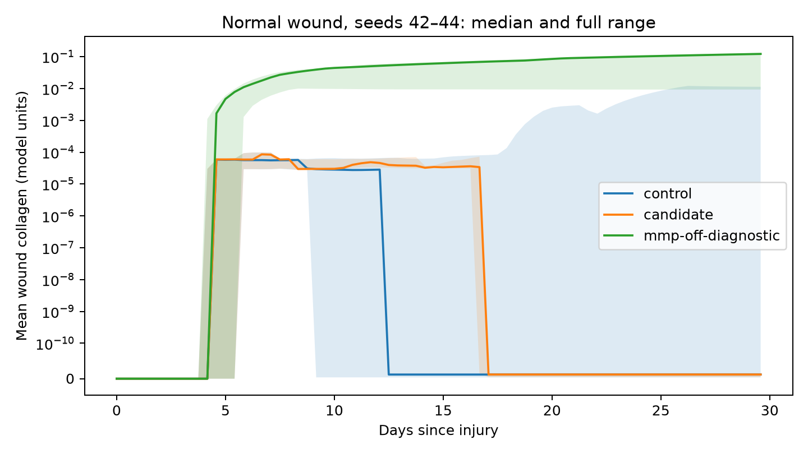

# Nitric oxide collagen evidence and matrix-loss diagnosis

2026-10-07. This pass removes the unsupported universal NO collagen inhibitor
and identifies a major contributor to persistent matrix loss. It does not
establish accurate wound repair: every control, candidate and diagnostic run
still fails the engineering validation screens.
The [validation audit](../validation-audit-20261007/README.md) re-scores this
frozen evidence and documents why a target mismatch is not empirical biological
validation. The original archive and its reports retain their historical method.

## Evidence and implementation

[Schaffer et al. 1996](https://pubmed.ncbi.nlm.nih.gov/8661204/)
(doi:10.1006/jsre.1996.0254) reported reduced wound collagen accumulation and
breaking strength after NOS inhibition. The old inhibitory multiplier cited
this paper in the opposite direction.

[Witte et al. 2000](https://pubmed.ncbi.nlm.nih.gov/11139365/)
(doi:10.1006/niox.2000.0307) found increased dermal fibroblast collagen
synthesis after SNAP exposure. At 100 and 400 micromolar donor concentration,
reported increases were 74.3% and 87.5%, respectively.
[Obayashi et al. 2006](https://pubmed.ncbi.nlm.nih.gov/16171977/)
(doi:10.1016/j.jdermsci.2005.08.004) also found increased type I collagen
synthesis in normal human dermal fibroblasts exposed to NO donors.

[A rat granuloma experiment](https://pubmed.ncbi.nlm.nih.gov/23290597/)
(doi:10.1016/j.jss.2012.11.056) found impaired collagen accumulation with
excessive NO during sterile inflammation. These distinct exposure contexts
do not establish a universal inhibitory response. Donor concentration is not
free NO concentration, and this model's NO field has no physical dose mapping.

[FibroblastBehavior](../../modules/fibroblast/fibroblast_behavior.h) therefore
no longer multiplies collagen deposition by `max(0, 1 - strength * NO)`.
The parameter, configuration key and binding were removed. Direct NO control
of collagen remains unmodeled; no stimulatory or biphasic curve was invented.
Oxygen, lactate and diabetic deposition modifiers remain active. The NO module
still supplies its vasodilation and antimicrobial couplings.

Source notes, parameter provenance and module guides now distinguish qualitative
NO biology from assumed numerical coefficients. The diabetic NO modifier remains
assumed: [Schaffer et al. 1997](https://pubmed.ncbi.nlm.nih.gov/9142149/)
supports a wound NO deficit, without establishing the model's fixed per-cell
40% production reduction. No remaining numerical defaults were tuned.

## Matched simulations

The control is commit `668708c4268a44f8f3bb3b3c484d436c110e1022` from the
[preceding lactate experiment](../lactate-signal-20261007/README.md).
The candidate uses the source patch and hashes in [receipt.json](receipt.json).
Both use BioDynaMo v1.05.169, one OpenMP thread, seeds 42–44 and the maintained
`scripts/run_replicates.py` runner. Normal wound and full-model runs span
30 configured days, with final samples at 710 hours; diabetic wound runs span
35 days, with final samples at 820 hours. Sampling intervals account for the
gap between the final sample and configured endpoint.

All 18 control/candidate trajectories are finite and complete under the
runner's sampling criterion. Configuration comparisons allow only the removed
NO key and run output directory. Endpoint collagen is below `1e-9` model units
in seven of nine controls and all nine candidates. This numerical threshold
describes near-zero output; it is not an experimental normal range.
The repair does not improve matrix retention in this comparison. The two
previously retaining seed-42 trajectories also end near zero in the candidate.

## MMP diagnostic

The MMP post hook removes up to `effective_MMP * collagen_degradation` per
reaction update, capped by available collagen and scaled by the coarse-grid
weight. This can consume a small deposited collagen pool completely. Cells
still capable of producing collagen occur in the near-zero trajectories, so
absence of producers alone does not explain their loss.

Three additional normal-wound runs use the same candidate binary and seeds,
with only `skin.mmp.collagen_degradation = 0` as an isolated intervention.
Other MMP effects remain active. The archived adapter uses the maintained
runner and does not change a production configuration or default.

| Seed | Control final collagen | Candidate final collagen | MMP collagen breakdown disabled |
|------|------------------------|--------------------------|---------------------------------|
| 42 | 0.0113144 | 1.57891e-11 | 0.121842 |
| 43 | 1.17331e-11 | 1.18004e-11 | 0.130795 |
| 44 | 3.66894e-12 | 4.15298e-12 | 0.00928427 |

All values are mean wound collagen in model units at 710 hours.
This intervention establishes a major contribution from the modeled MMP
collagen sink in these seeds. It does not establish a measured degradation
rate, a replacement kinetic law, or that biological remodeling should be
disabled. All three diagnostic runs also fail biological validation.



The plot uses a symmetric logarithmic axis with a linear region below `1e-10`.
[summary.csv](summary.csv) records every run's endpoint, peak collagen and
validation status. The lack of physical NO exposure and collagen/MMP activity
calibration remains a limit on quantitative biological accuracy.

## Verification and evidence

The added regression runs the scheduler for activated fibroblasts and
myofibroblasts in both fibroblast synthesis modes. Under the former multiplier,
the regression fails at controlled nonzero NO exposures. After a clean rebuild,
all 175 C++ tests pass; deposition stays oxygen-dependent and the uncalibrated
NO field does not impose the removed direct inhibition. This verifies the
implemented omission, not physiological independence from NO.

Python workflow checks execute 66 passing tests with three runtime-gated skips.
All 37 reference CSVs pass quality checks. Source checks pass with two existing
unresolved locator warnings in the psoriasis and scar lists.

The first incremental artifact set crashed during the C++ suite. The exact
trigger was not isolated; the clean rebuild passes and supplies every candidate
and diagnostic simulation here. An initial oversubscribed simulation attempt
was canceled before that rebuild; it is excluded from the comparison.

[evidence.zip](evidence.zip) contains 165 byte-verified entries: the 21 run
configurations, trajectories, process logs, validation reports and receipts;
three runtime identities; implementation patch; diagnostic and export scripts;
and both failing and passing check logs. SHA-256 inventory and archive digest
are in `receipt.json`. To reproduce the candidate matrix in the documented
BioDynaMo environment:

```sh
OMP_NUM_THREADS=1 OMP_DYNAMIC=FALSE python scripts/run_replicates.py \
  --matrix --n 3 --build-dir build \
  --out-dir batch/results/no-collagen-reproduction
```
